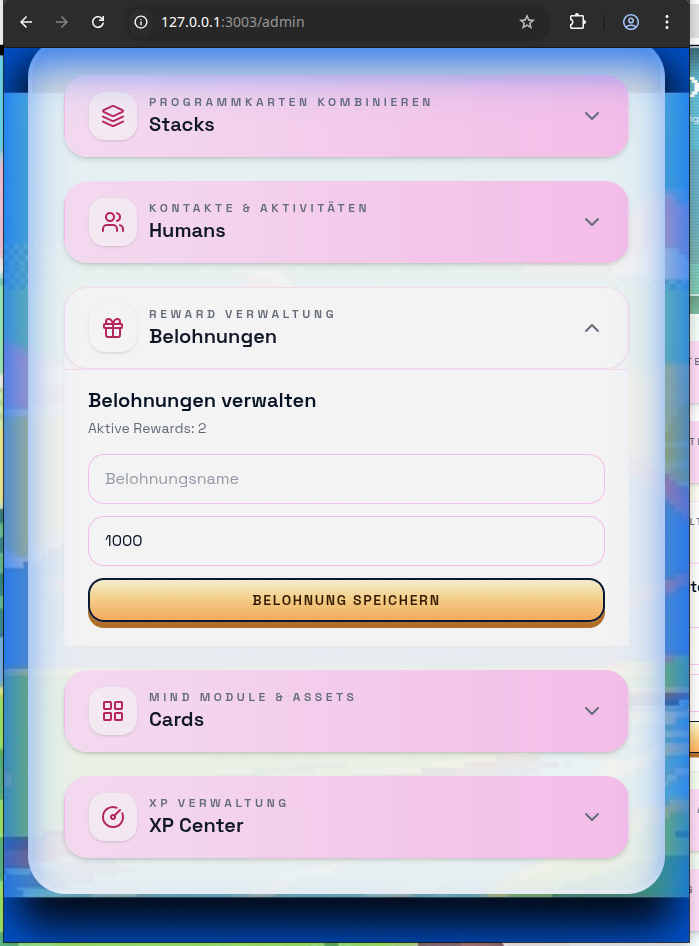

# Fehler Sammlung

## Offen
Optimiere die Mobile Ansicht, sodass der Hintergrund (video) die komplette fläche bedeckt und oben und unten keine dunklen balken / ränder enthalten sind.
Optimiere den code um eine bessere mobile ansicht (responsive design) zu erzeugen. die app wird immer auf einen smart phone angezeigt werden (senkrecht).

### Anforderungen
- video füllt komplette hintergrund ohne balken und ist optimal für mobile ansicht optimiert vergrößert
- das eingabe formular ist optimal für mobile ansicht optimiert vergrößert und perfekt zentriert
- Schriftgrößen sind optimal für mobile ansicht optimiert vergrößert.
- das formular ist perfekt zentriert
- das menue ist perfekt zentriert und die icons haben die optimale größe und abstand zu einander.
- responsive design

# Fertig ~~~~~~~~~~~~~~~~~~~~~~~~~~~~~~~~~~~~~~~~~~~~~~~~~~~~~~~~~~~~~~~~~~~~~~~~~~

## Fertig
- Seite: http://localhost:3003/rewards & http://localhost:3003/score
- Fehler: Wenn man Belohnungen einlöst, werden die Punkte in der Ansicht "http://localhost:3003/score" als betrag von mind abgezogen.
- Optimale Lösung: Das einlösen von Belohnungen soll keinen Einfluss auf die Punkte in der Ansicht "http://localhost:3003/score" haben.

- Seite: http://localhost:3003/admin
- Bereich: Belohnungen verwalten
- Fehler: Die erstellten Belohnungen werden nicht angezeigt.
- Optimale Lösung: Die erstellten Belohnungen werden angezeigt. Damit erstellte Belohnungen angepasst oder gelöscht werden können.

